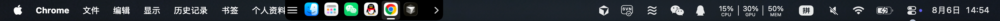
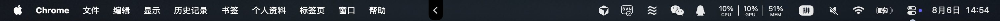
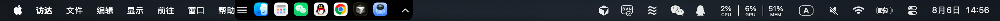
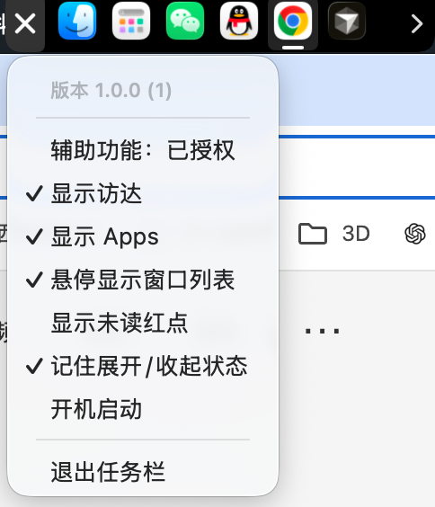
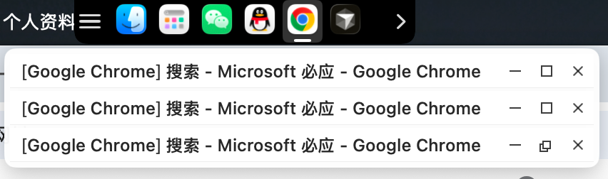

# Mac Active Applications

贴在菜单栏区域的 Windows 风格任务栏：列出当前运行中的应用，支持切换与恢复、拖拽排序、拖动整栏位置、双模式收起、未读红点、悬停窗口操作、右键菜单，以及系统 Apps（原启动板）入口。

不限刘海机型——有刘海时可贴在缺口左侧；无刘海或外接屏则使用菜单栏左侧可用区。拖离右缘后可**向上收起**成细条，多数显示器都能干净收纳。

[English](README_EN.md)

## 截图

展开（贴齐右缘，把手 `>`）：



横向收起后仅剩把手 `<`：



拖离右缘后展开（把手 `∧`，可向上收起）：



汉堡设置菜单：



悬停窗口列表：



## 功能

- 贴在菜单栏高度、上沿齐顶；有刘海时默认靠缺口左侧，无刘海时落在菜单栏左侧可用区；下沿圆角
- 宽度随运行中应用数量自适应（有上限）
- **按住汉堡**可在可用区内水平拖动整条任务栏，松手后记住位置；**点击**汉堡仍打开设置
- 点击把手收起 / 展开（无 hover 自动展开）；把手仅左键，无右键退出
  - **贴齐可用区右缘**（有刘海即贴缺口）：`>` / `<`，横向收起只留右侧把手
  - **拖离右缘后**：`∧` / `∨`，向上收成约一图标宽的顶边细条（无刘海机型的常用收纳方式）
- 默认图标顺序：访达 → Apps（启动板）→ 其它运行中应用（按名称）；**可拖拽排序**，松手后记住位置
- 单击图标：切换到前台；若已是前台且有可见窗口则隐藏（Windows 任务栏语义）
- 最小化或关窗未退出时，点击可恢复到前台（Dock 式 reopen）
- **Apps / 启动板**固定入口（默认在访达后）：单击切换开合，与 Dock 行为一致；无右键、无悬停列表
- **未读红点**：有 Dock 角标的应用在任务栏显示红点（不显示数字）；来消息时图标短暂跳动；需辅助功能
- 悬停任意有可见窗口的应用：弹出标题栏列表（`[应用名] 窗口标题`，含单窗口）
  - 点击标题聚焦窗口
  - 最小化 / 最大化（可还原）/ 关闭（需辅助功能权限）
- **右键应用图标**（不含 Apps）：
  - 通用：显示、隐藏、在访达中显示、退出
  - 访达额外：新建访达窗口
- **汉堡菜单**（最左侧，仅展开时显示；打开时图标旋转为 X）：
  - 版本信息（不可点）
  - 辅助功能状态（打开系统设置；系统授权框最多自动弹一次）
  - 显示访达（勾选）
  - 显示 Apps（勾选）
  - 悬停显示窗口列表（勾选）
  - 显示未读红点（勾选；关闭后停止 Dock 角标轮询）
  - 记住展开/收起状态（勾选）
  - 开机启动（勾选；需以 `.app` 运行才稳定生效）
  - 退出任务栏
- 菜单栏工具形态：不占用 Dock（`LSUIElement` / `.accessory`）
- 界面文案跟随系统语言（简体中文 / English）

## 环境要求

- macOS 13+（Apps 入口在 macOS 26+ 对应 `/System/Applications/Apps.app`；旧系统回退 Launchpad.app）
- Xcode / Swift 5.9+（命令行工具即可）
- **辅助功能**权限：窗口列表与窗口按钮、未读红点（读 Dock 角标）需要
- **界面语言**：跟随系统语言（当前支持简体中文 / English）；不做应用内切换

## 快速运行

```bash
cd MacActiveApplications
swift run
```

或用 Xcode 打开：

```bash
open Package.swift
```

选择 scheme `MacActiveApplications`，目标 My Mac，Run。

## 如何退出

本工具无 Dock 图标，可用：

- 汉堡菜单 → **退出任务栏**
- 终端 `swift run` 时：`Ctrl + C`
- 或：`killall MacActiveApplications`

## 打包 DMG

```bash
./scripts/package-dmg.sh
```

默认打出 **Universal**（`arm64` + `x86_64`）一份 `.app` / DMG，Apple Silicon 与 Intel 都可安装。也可只打单架构：

```bash
ARCHS=arm64 ./scripts/package-dmg.sh    # 仅 Apple Silicon
ARCHS=x86_64 ./scripts/package-dmg.sh   # 仅 Intel
```

在 Apple Silicon 上编 `x86_64` 需已安装 Rosetta（系统会按需提示）。可用 `lipo -archs dist/MacActiveApplications.app/Contents/MacOS/MacActiveApplications` 确认架构。

产物：

- `dist/MacActiveApplications.app`
- `dist/MacActiveApplications-<版本号>.dmg`（版本取自 `Resources/Info.plist` 的 `CFBundleShortVersionString`）

安装：打开 DMG，将 App 拖入「应用程序」。首次使用请在：

**系统设置 → 隐私与安全性 → 辅助功能**

中勾选本应用。

## 项目结构

```text
Sources/MacActiveApplications/
  AppDelegate.swift                 # 入口
  Geometry/MenuBarGeometry.swift    # 菜单栏可用区 / 刘海贴齐几何
  Model/
    RunningAppsStore.swift          # 运行中应用列表、排序、激活与右键动作
    RunningAppItem.swift
    DockBadgeMonitor.swift          # Dock 角标轮询 → 未读红点
    AppWindowService.swift          # 窗口枚举 / 最小/最大/关闭（Accessibility）
    SystemAppsLauncher.swift        # Apps / 启动板切换（CoreDockSendNotification）
    AppContextMenuBuilder.swift     # 应用图标右键菜单
    TaskbarPreferences.swift        # 设置项（UserDefaults / 开机启动）
    TaskbarSettingsMenuBuilder.swift # 汉堡 NSMenu
  L10n.swift                        # 本地化文案入口（跟随系统语言）
  Resources/
    en.lproj/Localizable.strings
    zh-Hans.lproj/Localizable.strings
  Panel/
    MenuBarPanel.swift              # 任务栏面板
    WindowPeekController.swift      # 悬停标题栏弹出层
  UI/
    TaskbarView.swift               # 图标 / 把手 / 汉堡 / 拖拽 / 红点
    TaskbarStyle.swift              # 尺寸与样式常量
Resources/
  Info.plist
  AppIcon.icns                      # 打包用图标
  AppIcon.icon/                     # Icon Composer 源（可选）
scripts/
  package-dmg.sh                    # Release 编译 → .app → DMG
docs/
  更新说明.md                       # 版本更新说明
```

## 常用配置

在 `UI/TaskbarStyle.swift` 中可调：

| 常量 | 含义 |
|------|------|
| `handleWidth` / `collapsedWidth` | 贴齐右缘时横向收起的把手宽度 |
| `detachedCollapsedHandleWidth` | 拖离后向上收起条带宽度 |
| `collapsedStripHeight` | 向上收起时的顶边细条高度 |
| `settingsButtonWidth` | 汉堡按钮宽度 |
| `handleTrailingExtension` | 右缘贴齐微调（有刘海时相对缺口） |
| `notchVisualCompensationRatio` | 有刘海时贴齐视觉补偿比例 |
| `peekMinWidth` / `peekMaxWidth` | 悬停标题栏宽度范围 |
| `peekHideDelay` | 悬停离开后收起延迟 |
| `unreadBadgeDotMin` / `Max` | 未读红点尺寸范围 |

角标轮询间隔见 `Model/DockBadgeMonitor.swift` 中的 `pollInterval`。

## 权限说明

| 能力 | 权限 |
|------|------|
| 列出运行中应用、激活 / hide / reopen | 一般不需要特殊权限 |
| 窗口标题、最小/最大/关闭 | **辅助功能（Accessibility）** |
| 未读红点（读 Dock `AXStatusLabel`） | **辅助功能（Accessibility）** |
| Apps / 启动板切换 | 经 Dock 私有通知（`CoreDockSendNotification`），一般无需额外权限 |
| 访达「新建窗口」 | AppleScript 控制访达（系统可能弹出自动化权限提示） |

未授权辅助功能时，任务栏主体仍可用；窗口标题栏按钮与未读红点会不可用或降级。系统授权框最多自动弹出一次，之后请从汉堡菜单打开设置手动授权。

## 技术栈

- Swift / AppKit / SwiftUI
- Swift Package Manager（executable）
- Accessibility (`AXUIElement`) + `NSWorkspace` / Apple Event reopen
- Dock：`CoreDockSendNotification("com.apple.launchpad.toggle")`；角标经 Dock `AXStatusLabel`

## 已知限制

- 展开时会占用菜单栏左侧一段区域，可能挡住部分系统菜单项（产品设计如此；可拖开或向上收起）
- 最大化几何在极端多屏布局下可能需再校准
- Apps 入口依赖系统 Dock 接口；极端系统版本差异下行为可能需再验证
- 未读红点依赖 Dock 中对应图标的角标；移出 Dock 或未授权辅助功能时无法显示
- 当前为本地工具打包（ad-hoc 签名）；对外分发建议 Developer ID + 公证

## 相关文档

- [更新说明](docs/更新说明.md)
- [English README](README_EN.md)

## 许可

未经作者授权，不允许私自转载。
